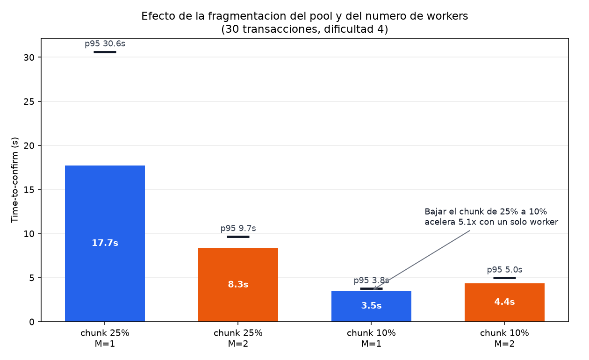
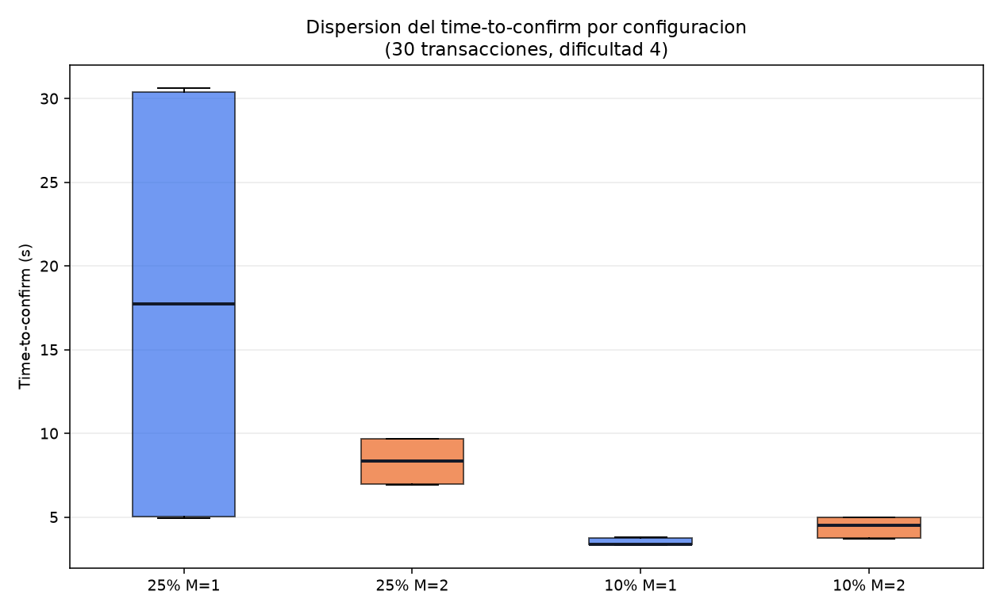
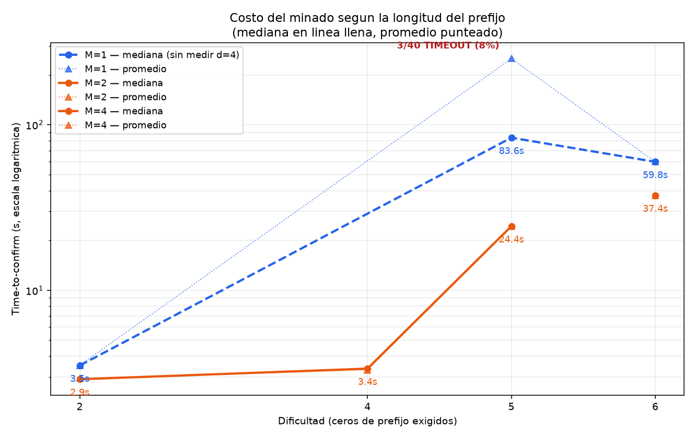
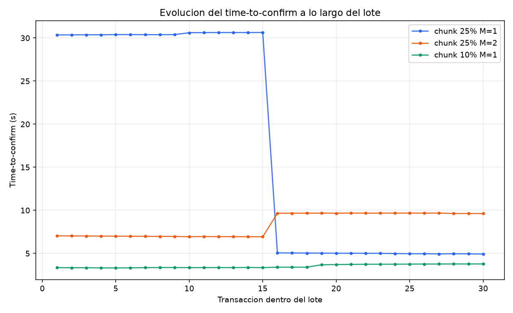

# Informe — análisis de resultados

Sistema de entradas con blockchain propia y Proof of Work.
**SDyPP — UNLU, 2026.**

Este documento une las dos capas de medición del trabajo: el benchmark de minería
GPU vs CPU de [Pilar 1](../Pilar1/) y las pruebas de carga del sistema distribuido
completo de [Pilar 2](../Pilar2/P5/). Los datos crudos están en
[`Pilar2/P5/resultados/`](../Pilar2/P5/resultados/) y los gráficos se regeneran con
`python Pilar2/P5/graficos.py`.

---

## 1. Qué se midió, y con qué límites

Dos niveles distintos, que responden preguntas distintas:

| Nivel | Qué mide | Herramienta |
|---|---|---|
| **Micro** (Pilar 1) | Tiempo de encontrar un nonce válido, aislado | Notebooks en Colab, Tesla T4 |
| **Sistema** (Pilar 2) | *Time-to-confirm*: de enviar la transacción a verla en un bloque | `loadtest.py` contra el stack de docker compose |

### Tres limitaciones que condicionan la lectura

Conviene declararlas antes de los números, porque cambian cómo hay que
interpretarlos.

**1. El time-to-confirm es por bloque, no por transacción.** El gráfico de
evolución lo muestra sin ambigüedad: es una función escalón. En la transacción 16
el tiempo salta de golpe, porque todas las transacciones que entran en el mismo
bloque se confirman juntas. Por lo tanto, una corrida de 30 transacciones **no son
30 muestras independientes**: son ~2 observaciones (una por bloque) repetidas. Los
promedios que siguen son sólidos para comparar configuraciones entre sí, pero su
precisión estadística es mucho menor de lo que sugiere el `n=30`.

**2. No hubo repeticiones de la misma configuración.** Cada celda de la matriz se
corrió una vez. No hay intervalos de confianza.

**3. El minado local es en CPU.** Las corridas de Pilar 2 se hicieron con el
worker CPU sobre docker compose, sin GPU. La comparación GPU vs CPU vive
enteramente en el nivel micro.

---

## 2. Nivel micro: GPU vs CPU en el minado puro

Batería de Pilar 1, MD5 con prefijo creciente:

| Prefijo | Nonce encontrado | GPU (CUDA) | CPU (Python) | Speedup |
|---|---|---|---|---|
| `0` | 0 | 0,85 ms | 0,02 ms | **0,02×** |
| `00` | 42 | 0,92 ms | 0,06 ms | **0,07×** |
| `000` | 5.519 | 0,92 ms | 6,01 ms | 6,5× |
| `0000` | 16.374 | 0,91 ms | 17,20 ms | 18,9× |
| `00000` | 105.281 | 1,78 ms | 115,41 ms | 64,8× |
| `000000` | 1.736.235 | 15,05 ms | 1.919,94 ms | **127,6×** |

El cruce está entre 2 y 3 caracteres de prefijo. Con prefijos cortos **la CPU
gana**, porque el costo fijo de lanzar el kernel —reservar memoria en el
dispositivo, transferir, sincronizar— es mayor que el cómputo mismo. A partir de
ahí la ventaja de la GPU crece de forma acelerada, porque el trabajo se vuelve
suficientemente grande como para amortizar ese costo fijo y aprovechar el
paralelismo masivo.

Notar que el tiempo de GPU es casi plano hasta prefijo 5 (0,85 → 1,78 ms): la
placa resuelve esos espacios de búsqueda casi sin despeinarse, y lo que se mide es
básicamente el overhead. Recién en prefijo 6 el cómputo empieza a dominar.

---

## 3. Nivel sistema: qué gobierna el time-to-confirm

### 3.1 Fragmentación del pool vs cantidad de workers

30 transacciones, dificultad 4:

| Configuración | Promedio | p50 | p95 |
|---|---|---|---|
| chunk 25%, M=1 | 17,74 s | 17,71 s | 30,63 s |
| chunk 25%, M=2 | 8,32 s | 8,33 s | 9,68 s |
| chunk 10%, M=1 | **3,51 s** | 3,38 s | 3,78 s |
| chunk 10%, M=2 | 4,37 s | 4,52 s | 4,99 s |

**El resultado central del trabajo:** fragmentar más el pool rindió **5,05×**,
mientras que duplicar los workers rindió **2,13×**. Y lo más contraintuitivo: con
chunk al 10%, **agregar un segundo worker empeoró** el tiempo (3,51 → 4,37 s).

La explicación es que son dos palancas que atacan cosas distintas. Bajar el
tamaño del chunk hace que cada subtarea termine antes, así que el NCT recibe una
solución candidata más rápido y no queda esperando a que un worker barra un rango
largo de punta a punta. Sumar workers, en cambio, solo ayuda si hay suficientes
chunks pendientes como para mantenerlos ocupados. Cuando el chunk ya es chico, un
worker solo alcanza para drenar la cola, y el segundo agrega coordinación —
distribución de mensajes, contención en el NCT al validar— sin trabajo útil que
absorber.

### 3.2 Predictibilidad, no solo velocidad

Este gráfico muestra algo que las tablas de promedios esconden. La configuración
chunk 25% / M=1 no es solamente la más lenta: es **la más impredecible**, con
tiempos dispersos entre 5 y 30 segundos. La configuración chunk 10% / M=1 se
concentra en una banda estrechísima alrededor de 3,5 s.

Para un sistema de venta de entradas, esa diferencia importa más que el promedio.
Un comprador que espera 5 segundos y otro que espera 30 en la misma tanda es un
problema de experiencia de usuario aunque el promedio "cierre".

### 3.3 El costo de la dificultad

Escala logarítmica; línea llena es la mediana, punteada el promedio.

| Dificultad | M=1 mediana | M=2 mediana | Observaciones |
|---|---|---|---|
| 2 (`00`) | 3,51 s | 2,90 s | Sin diferencia significativa |
| 4 (`0000`) | — (sin medir) | 3,36 s | |
| 5 (`00000`) | 83,59 s | 24,38 s | **3 de 40 transacciones dieron TIMEOUT con M=1** |

Dos cosas para leer acá. La primera es la separación entre mediana y promedio en
dificultad 5 con un worker: 83,59 s contra 251,32 s. Esa brecha de 3× significa
que unas pocas transacciones tardaron muchísimo más que el resto, arrastrando el
promedio. Reportar solo el promedio habría hecho parecer típico un valor que no lo
es.

La segunda es que en esa misma celda **el 8% del lote nunca confirmó**. Con
dificultad 5 y un solo worker CPU, el sistema no solo se pone lento: empieza a
fallar. Ese es el techo práctico del minado en CPU, y coincide con lo documentado
en `RESUMEN.md` sobre dificultad 6, donde directamente no se pudo completar
ninguna corrida.

### 3.4 Comportamiento a lo largo del lote

La función escalón mencionada en §1. Sirve como evidencia visual de que el
sistema agrupa transacciones en bloques y de que el time-to-confirm de una
transacción depende de en qué bloque le tocó caer, no de su posición en la cola.

---

## 4. Síntesis: los dos niveles juntos

Acá está, para nosotros, la conclusión más interesante del trabajo.

Pilar 1 demuestra que la GPU puede ser **127× más rápida** hasheando. Pilar 2
demuestra que, en el sistema completo y a las dificultades que pudimos medir, la
palanca dominante no fue la potencia de cómputo sino **cómo se reparte el
trabajo**: cambiar el tamaño del chunk rindió 5×, sin tocar una sola línea del
minero.

Eso no contradice el resultado de Pilar 1, lo pone en contexto. El speedup de la
GPU aplica a la porción del tiempo que se gasta hasheando. En dificultad 4, esa
porción no era la que dominaba el time-to-confirm: dominaban la granularidad de
las subtareas y la latencia de coordinación entre NCT, TrP y workers. Acelerar el
hashing 127× no habría movido mucho la aguja mientras el cuello de botella estaba
en otro lado.

La transición se ve empezar en dificultad 5, donde aparecen los timeouts: ahí sí
el cómputo pasa a ser el límite, y ahí sí una GPU cambiaría el resultado
cualitativamente. Es exactamente la razón por la que las blockchains reales, que
operan con dificultades muchísimo mayores, son inequívocamente compute-bound.

**En una frase:** optimizar el componente más llamativo no sirve si el cuello de
botella está en otra parte, y solo la medición del sistema completo dice dónde
está.

---

## 5. Reflexión crítica

### 5.1 Limitaciones de la arquitectura

**El NCT es un punto único de falla.** Concentra la API, el auto-miner, la
validación y la escritura de la cadena. Tiene 2 réplicas con un lock distribuido
en Redis, pero el lock serializa el minado: dos réplicas no minan dos bloques en
paralelo, se turnan. Escala la disponibilidad, no el throughput.

**La dificultad es fija.** Las blockchains reales la reajustan solo para mantener
constante el tiempo entre bloques. Acá se fija a mano y solo se mueve por el
fallback GPU→CPU. Sin ajuste automático, un cambio en la capacidad de minado
desplaza el tiempo de bloque sin que el sistema reaccione.

**El tamaño de chunk es una constante global.** Después de haber medido que es la
variable más influyente, es notable que sea un parámetro fijo y no algo que el TrP
ajuste según la cantidad de workers vivos y la dificultad vigente. Es la mejora
con mejor relación esfuerzo/beneficio que identificamos.

**El fallback depende de la API de Kubernetes.** `scale_cpu_workers()` escala el
deployment vía la API in-cluster. Fuera de un cluster —por ejemplo, en el compose
local— falla y solo deja un error en el log. Funciona, pero acopla la lógica de la
blockchain a su plataforma de despliegue.

**El pool es cooperativo, sin modo competitivo.** El reparto de rangos disjuntos
es la decisión correcta para workers propios que colaboran, pero implica que el
sistema no modela la dinámica de una red abierta donde los mineros compiten y no
confían entre sí.

### 5.2 Limitaciones de la medición

- Una sola corrida por configuración, sin intervalos de confianza.
- ~2 observaciones independientes reales por corrida, por la confirmación en bloque.
- Sin datos de GPU a nivel sistema: la comparación GPU vs CPU es solo micro.
- Rango de dificultad efectivo 2 a 5. El checklist pedía hasta 8; con minado en
  CPU eso no era alcanzable, y preferimos documentar el techo medido antes que
  extrapolar.
- Bulks hasta 50 transacciones, lejos de las 100.000 del enunciado.

### 5.3 Mejoras propuestas, en orden de impacto esperado

1. **Chunk adaptativo.** Que el TrP calcule el tamaño en función de los workers
   vivos y la dificultad, en lugar de usar una constante. Es la palanca que
   medimos como dominante.
2. **Ajuste automático de dificultad**, apuntando a un tiempo de bloque objetivo.
3. **Desacoplar el auto-miner del NCT**, para que la coordinación y la API puedan
   escalar por separado.
4. **Persistir la cadena fuera de Redis** (o replicar Redis), hoy es el único
   lugar donde vive el estado autoritativo.
5. **Modo competitivo detrás de un flag**, que además permitiría comparar los dos
   protocolos con la misma matriz de pruebas.

### 5.4 ¿Dónde aplicaría esta solución en un contexto real?

Con honestidad: **una blockchain propia con PoW no es la respuesta correcta para
vender entradas.** El PoW existe para lograr consenso entre partes que no confían
entre sí, y acá hay un operador único —nosotros— que ya es la autoridad. Estamos
pagando el costo del consenso descentralizado sin obtener su beneficio.

Lo que sí resuelve bien el sistema, y es la parte que valdría la pena conservar,
es el **modelo de propiedad criptográfica**: cada entrada pertenece a una clave
pública, cada transferencia va firmada, y la validación en puerta es una
transferencia de vuelta al organizador. Eso hace que una entrada no se pueda
duplicar ni usar dos veces, y que el asistente pueda probar que es suyo sin
depender de la palabra del emisor. Ese diseño resuelve la reventa fraudulenta y el
doble uso, que son los problemas reales del negocio.

En una implementación productiva, ese modelo iría sobre una blockchain existente
—donde el consenso ya es un servicio— o directamente sobre un registro firmado y
auditable, sin PoW. El valor de haberlo construido desde cero es entender
exactamente qué aporta cada pieza y, sobre todo, cuál no hacía falta.
